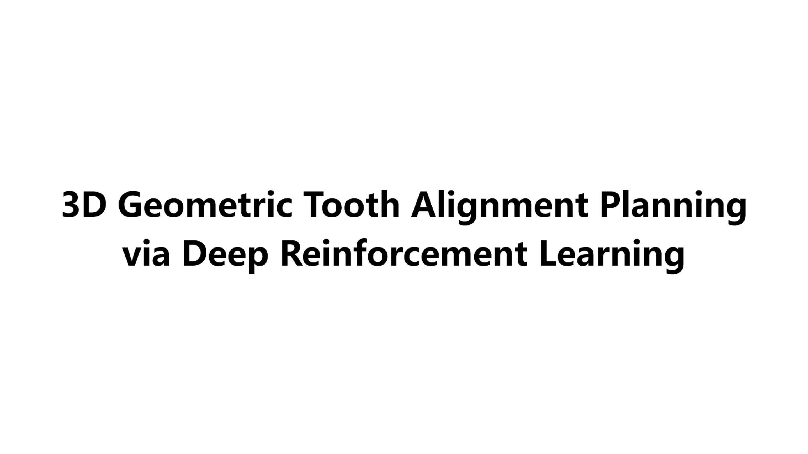

# 3D Geometric Tooth Alignment Planning via Deep Reinforcement Learning

[](https://github.com/ljw-zju/3DGTAP-DRL/releases/v1.0-video/demo.mp4)


In this study, we present a novel deep reinforcement learning-based approach to automated 3D geometric tooth alignment planning.
The method frames the problem as a Markov Decision Process(MDP) to capture the sequential decision-making nature of the task.

## Overview of the Framework

Our framework consists of a custom RL environment and a DDPG agent with several key innovations:
(1) a transformer-based agent to model complex tooth interactions and handle high-dimensional state and action spaces.
(2) a dynamic masking scheme to limit movement to a sparse set of teeth at each step, reflecting clinical practice.
(3) a two-stage curriculum learning strategy to gradually tighten the conditions, improving training stability and reducing exploration challenges.


---

## Usage

### Training

To train the RL agent from scratch, run the main training script. 

```bash
python ddpg.py \
    --seed 2024 \
    --total_timesteps 2000000 \
    --buffer_size 1000000 \
    --gamma 0.95 \
    --batch_size 256 \
    --actor_learning_rate 1e-5 \
    --critic_learning_rate 1e-4 \
    --train_dir "data/train_data"
```


### Visualization and Evaluation

We provide a simple shell script to visualize the results of a pre-trained model on a given test case.

```bash
bash test.sh [PATH_TO_PRETRAINED_MODEL] [CASE_ID] [OUTPUT_DIRECTORY]
```


## License
This project is licensed under CC BY-NC-SA 4.0.
- Free for academic research and non-commercial use only.
- Any commercial usage requires separate authorization from the authors.
- Please cite our paper if you use this code.